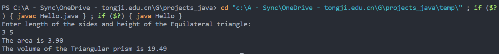
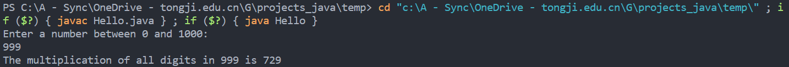
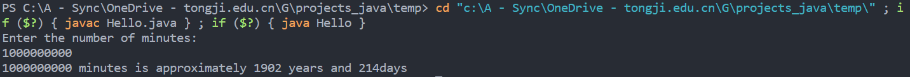
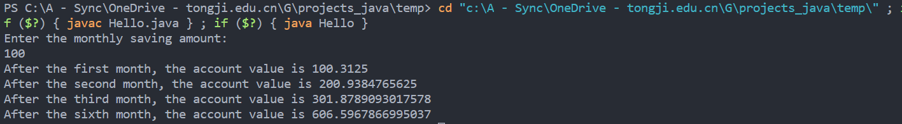
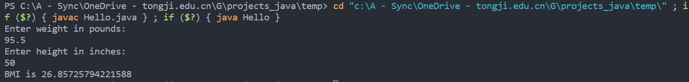

# JAVA


## Compute the volume of a triangle

```java
import java.util.*;
public class Volume {
    /* Main method */
    public static void main(String [] args) {
        System.out.println("Enter length of the sides and height of the Equilateral triangle: ");
        Scanner input = new Scanner(System.in);
        double tri_area, tri_vol;
        double tri_len = input.nextDouble();
        double tri_height = input.nextDouble();
        tri_area = Math.sqrt(3) / 4 * tri_len * tri_len;
        tri_vol = tri_area * tri_height;
        System.out.printf("The area is %.2f", tri_area);
        System.out.printf("\nThe volume of the Triangular prism is %.2f", tri_vol);
        input.close();
    }    
}
```



## Multiply the digits in an integer

```java
import java.util.*;
public class MultiplyDigits {
    /* Main method */
    public static void main(String [] args) {
        System.out.println("Enter a number between 0 and 1000: ");
        Scanner input = new Scanner(System.in);
        int integer = input.nextInt();
        int n = integer;
        int product = 1;
        int temp;
        while (n != 0) {
            temp = n % 10;
            product *= temp;
            n /= 10;
        }
        System.out.println("The multiplication of all digits in " + integer + " is " + product);
        input.close();
    }
}
```



## Find the number of years

```java
import java.util.*;
public class NumberOfYears {
    /* Main method */
    public static void main(String [] args) {
        System.out.println("Enter the number of minutes: ");
        Scanner input = new Scanner(System.in);
        int minutes = input.nextInt();
        int years = minutes / 60 / 24 / 365;
        int days = minutes / 60 / 24 - years * 365;
        System.out.println(minutes + " minutes is approximately " + years + " years and " + days + " days");
        input.close();
    }
}
```



## Financial application: compound value

```java
import java.util.*;
public class CompoundValue {
    /* Main method */
    public static void main(String [] args) {
        System.out.println("Enter the monthly saving amount: ");
        Scanner input = new Scanner(System.in);
        double monthSaving = input.nextDouble();
        double interestRate = 0.003125;
        double val_fir = monthSaving * (1 + interestRate);
        double val_sec = (val_fir + monthSaving) * (1 + interestRate);
        double val_thir = (val_sec + monthSaving) * (1 + interestRate);
        double val_six = val_thir;
        for (int x = 3; x > 0; x -= 1) {
            val_six = (val_six + monthSaving) * (1 + interestRate);
        }
        System.out.println("After the first month, the account value is " + val_fir);
        System.out.println("After the second month, the account value is " + val_sec);
        System.out.println("After the third month, the account value is " + val_thir);
        System.out.println("After the sixth month, the account value is " + val_six);
        input.close();
    }
}
```



## Health application: computing BMI

```java
import java.util.*;
public class CalBMI {
    /* Main method */
    public static void main(String [] args) {
        Scanner input = new Scanner(System.in);
        System.out.println("Enter weight in pounds: ");
        double weight = input.nextDouble();
        System.out.println("Enter height in inches: ");
        double height = input.nextDouble();
        double bmi = weight * 0.45359237 / (height * 0.0254) / (height * 0.0254);
        System.out.println("BMI is " + bmi);
        input.close();
    }
}
```



